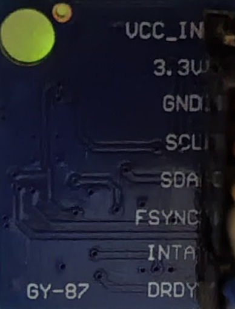
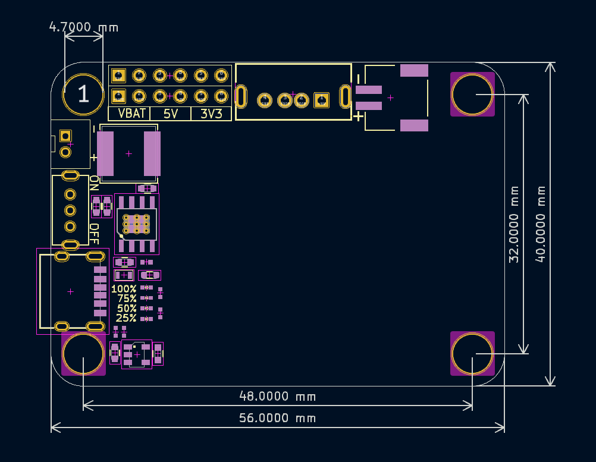

# 硬件设计文档

> **主控**：ESP32-WROOM-32 开发板（ESP32-DevKitC 风格，2×15 排针载板）。非 ESP32-C3。

## 采购链接

| 模块                                 | 链接                                                                  |
| ------------------------------------ | --------------------------------------------------------------------- |
| ESP32-WROOM-32 开发板                | https://detail.tmall.com/item.htm?id=805161973303&skuId=5879086331469 |
| 陀螺仪模块 | **GY-87**（10DOF，固件用 MPU6050） | 淘宝/立创搜 GY-87 |
| PM11锂电池包 (3.7V+充电+升压5V/2.4A) | https://item.taobao.com/item.htm?id=1007451636387&skuId=6002389453662 |
| SS-12D00 滑动开关                    | 待补充                                                                |
| JST-PH 2.0 座子                      | 待补充                                                                |

---

## 模块引脚

### ESP32-WROOM-32 开发板 (ESP32-DevKitC 风格)


```
尺寸: 51.85 × 23.5 mm
引脚: 左列 15pin + 右列 14pin, 2.54mm 间距, 排针间距 23.5mm
安装孔: 4× φ3mm, 距边 3mm
```

#### 左侧引脚 (从上到下, 15 pin)

| Pin | 引脚        | 功能说明                   |
| --- | ----------- | -------------------------- |
| 1   | 3V3         | 3.3V 电源输出              |
| 2   | EN          | 使能/复位引脚 (高电平有效) |
| 3   | GPIO36 (VP) | ADC1_CH0, 仅输入           |
| 4   | GPIO39 (VN) | ADC1_CH3, 仅输入           |
| 5   | GPIO34      | ADC1_CH6, 仅输入           |
| 6   | GPIO35      | ADC1_CH7, 仅输入           |
| 7   | GPIO32      | ADC1_CH4 / TOUCH9          |
| 8   | GPIO33      | ADC1_CH5 / TOUCH8          |
| 9   | GPIO25      | ADC2_CH8 / DAC_1           |
| 10  | GPIO26      | ADC2_CH9 / DAC_2           |
| 11  | GPIO27      | ADC2_CH7 / TOUCH7          |
| 12  | GPIO14      | ADC2_CH6 / TOUCH6 / MTMS   |
| 13  | GPIO12      | ADC2_CH5 / TOUCH5 / MTDI   |
| 14  | GND         | 接地                       |
| 15  | VIN         | 外部电源输入 (5V)          |

#### 右侧引脚 (从上到下, 14 pin)

| Pin | 引脚   | 功能说明                    |
| --- | ------ | --------------------------- |
| 16  | GPIO23 | VSPI MOSI                   |
| 17  | GPIO22 | I2C SCL                     |
| 18  | GPIO21 | I2C SDA                     |
| 19  | GND    | 接地                        |
| 20  | GPIO19 | VSPI MISO                   |
| 21  | GPIO18 | VSPI SCK                    |
| 22  | GPIO5  | VSPI SS / TOUCH5            |
| 23  | GPIO17 | UART2 TXD                   |
| 24  | GPIO16 | UART2 RXD                   |
| 25  | GPIO4  | TOUCH0 / ADC2_CH0           |
| 26  | GPIO2  | TOUCH2 / ADC2_CH2 / 板载LED |
| 27  | GPIO15 | U0 RTS / TOUCH3 / ADC2_CH3  |
| 28  | GND    | 接地                        |
| 29  | 3V3    | 3.3V 电源输出               |

> ⚠️ 注意事项:
>
> - GPIO34~39 仅输入，无输出、无内上下拉
> - GPIO6~11 被 SPI Flash 占用，不建议使用
> - GPIO12 上电影响 Flash 电压 (MTDI)，上电时保持低
> - GPIO0 下载模式 (板子底部 BOOT 按钮)
> - 板载 LED 在 GPIO2

### GY-87 模块（正式选型）



10DOF 蓝板，丝印 **GY-87**（MPU6050 + HMC5883L + BMP180）。久坐检测**仅使用 MPU6050 加速度计**，磁力计/气压计与固件无关。

```
引脚: 1 × 8pin 单排, 2.54mm
模块**背面**丝印（如上图，从左至右）: VCC_IN · 3.3V · GND · SCL · SDA · FSYNC · INTA · DRDY
载板 J2 **正面直插**时 Pin1 在 DRDY 侧、Pin8 在 VCC_IN 侧（与背照顺序相反）
```

#### J2 排母引脚映射（载板 / 直插）

| J2 Pin | GY-87 丝印 | 网络 | 连接 |
| ------ | ---------- | ---- | ---- |
| 1 | **DRDY** | — | NC |
| 2 | **INTA** | MPU_INT | ESP32 GPIO2 |
| 3 | **FSYNC** | — | NC |
| 4 | **SDA** | I2C_SDA | ESP32 GPIO4 |
| 5 | **SCL** | I2C_SCL | ESP32 GPIO5 |
| 6 | **GND** | GND | ESP32 GND |
| 7 | **3.3V** | — | **不接**（NC） |
| 8 | **VCC_IN** | 3V3 | ESP32 Pin1 (3V3) |

I2C 扫描：

```
0x68  MPU6050（固件使用）
0x77  BMP180（GY-87 自带，忽略）
0x1E  HMC5883L（可选，固件未用）
```

> **PCB 版本**：原理图 **v0.5.1** 已按载板正面插入修正 J2 引脚顺序；**PCB v0.4** 走线仍待改后打样。

#### 杜邦线联调（ESP32 扩展板）

| GY-87 丝印 | 扩展板 | 线色（参考） |
| ---------- | ------ | ------------ |
| VCC_IN | **3V3** | 红 |
| GND | **GND** | 橙 |
| SCL | **D5** | 黄 |
| SDA | **D4** | 绿 |
| INTA | **D2** | 蓝（可选） |
| 3.3V / FSYNC / DRDY | 不接 | — |

联调已验证（2026-06-22）：`0x68` + `0x77`，竖放基准角约 97°，`mock=0` 正常。

---

### 传感器安装姿态

**当前台架**：GY-87 **竖直立放**（芯片面垂直于桌面），非最终椅子安装姿态。

| 姿态 | 典型读数 | 说明 |
| ---- | -------- | ---- |
| 水平放置（Z 轴朝上） | 基准角 ≈ **0°** | 最终坐垫下安装目标姿态 |
| **竖直立放（当前）** | 基准角 ≈ **±90°**（实测约 **97°**） | 正常；算法看 **delta**，不是绝对角 |

竖放时上电校准后 `baseline` 约在 **90° 附近**，静止时 `delta` 应 **< 0.5°**、`state=VAC`。  
有人/受压时 **倾斜 1° 以上**（`delta > 1.0°`）才判为 `OCCUPIED`。

**最终产品**：模块应 **水平** 固定在坐垫下方，装好后串口发 `c` 重校准（基准角约 0°）。

### 供电模块 (PM11 电源板)



集成 **USB 充电 + 锂电管理 + 多路电源输出** 的独立电源板，通过排针向 ESP32 载板供电。

#### 外形尺寸

| 参数 | 值 |
|------|-----|
| PCB 尺寸 | **56.0 × 40.0 mm** |
| 安装孔间距 | 水平 **48.0 mm** × 垂直 **32.0 mm** |
| 安装孔 | 四角 M3（图中标注孔径约 φ4.7 mm，以实物为准） |
| 板厚 | 1.6 mm（常规） |

#### 板载功能

| 功能 | 说明 |
|------|------|
| USB 输入 | 左侧 USB 口，用于充电与外部供电 |
| ON/OFF 开关 | 左侧滑动开关，物理通断输出 |
| 电量指示 | 左侧四档 LED：**100% / 75% / 50% / 25%** |
| 充电管理 | TP4056 类充电 IC + 外围 RC |
| 电池接口 | 顶部 **4Pin** 电池座，丝印 **+ / −** 极性 |
| 电源输出 | 顶部 **2×6** 排针（2.54 mm） |

#### 2×6 排针（本设计关注）

排针位于板子顶部左侧区域；**底排**为常用电源轨（丝印可见）：

| 排针信号 | 说明 | 载板连接 |
|----------|------|----------|
| **VBAT** | 电池电压（未稳压） | 一般不接 ESP32 |
| **5V** | 升压/稳压 5V 输出 | → ESP32 **Pin15 (VIN)**（可经载板开关） |
| **3V3** | 3.3V 输出 | 备用；GY-87 从 ESP32 Pin1 取 3V3 |
| GND | 共地 | → ESP32 **Pin14/19/28** + 载板 GND 铺铜 |

> 上排 6Pin 功能以实物丝印为准；收到模块后**用万用表核对**再焊线。

#### 本设计电源路径

```
USB ──→ [供电模块] ── ON/OFF ──→ 5V 排针 ──→ 载板 ──→ ESP32 Pin15 (VIN)
              │                              │
              └── 电池 (4Pin +/-)             └── GND ──→ ESP32 GND
              └── 电量 LED (100/75/50/25%)

ESP32 板载 LDO: VIN(5V) → 3V3 Pin1 → GY-87 VCC_IN
```

#### 注意事项

1. 电池 **+/−** 切勿接反
2. 开关 OFF 时 ESP32 完全断电；ON 后 5V 才输出到排针
3. 充电时 USB 插入即可，与 ESP32 是否上电无关
4. GPIO2 接 GY-87 **INTA**，与 ESP32 板载 LED 共用

---

## 载板网络表（ESP32 ↔ GY-87 J2）

| 网络 | ESP32 排针 | 扩展板丝印 | J2 Pin | GY-87 丝印 |
| ---- | ---------- | ---------- | ------ | ---------- |
| — | — | — | 1 | DRDY (NC) |
| MPU_INT | Pin 26 (GPIO2) | D2 | 2 | INTA |
| — | — | — | 3 | FSYNC (NC) |
| I2C_SDA | Pin 25 (GPIO4) | D4 | 4 | SDA |
| I2C_SCL | Pin 22 (GPIO5) | D5 | 5 | SCL |
| GND | Pin 14/19/28 | GND | 6 | GND |
| — | — | — | 7 | 3.3V (NC) |
| 3V3 | Pin 1 | 3V3 | 8 | VCC_IN |

---

## 电源路径

```
供电模块 5V 排针 → 载板走线 → ESP32 Pin15 (VIN)
供电模块 GND     → 载板 GND  → ESP32 Pin14/19/28
```

（若载板仍保留 SS-12D00，则串联在 5V 排针与 VIN 之间。）

## 载板 BOM

| # | 元件            | 规格                | 封装 | 数量 |
| - | --------------- | ------------------- | ---- | :--: |
| 1 | ESP32 排母 (左) | 1×15P 2.54mm       | 直插 |  1  |
| 2 | ESP32 排母 (右) | 1×15P 2.54mm       | 直插 |  1  |
| 3 | GY-87 排母 | 1×8P 2.54mm（GY-87 引脚顺序，见 J2 表） | 直插 |  1  |
| 4 | PCB             | 100×80mm 2层 1.6mm | -    |  5  |

## PCB 规格

| 参数        | 值                         |
| ----------- | -------------------------- |
| 尺寸        | 100mm × 80mm, 2层         |
| 板厚        | 1.6mm                      |
| 铜厚        | 1oz                        |
| 安装孔      | 4× M3 (φ3.2mm), 距边 3mm |
| 线宽 (信号) | 0.254mm                    |
| 线宽 (电源) | 0.5mm                      |
| GND         | B.Cu 铺铜                  |
